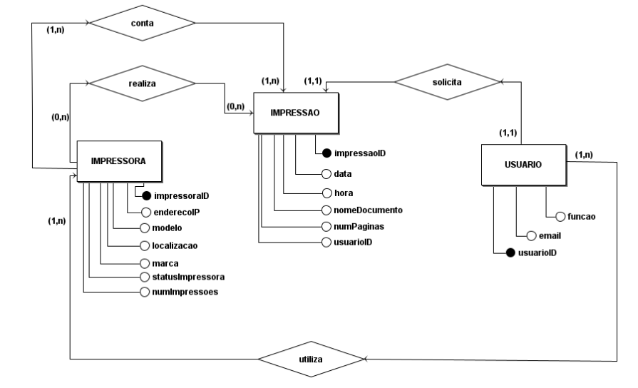
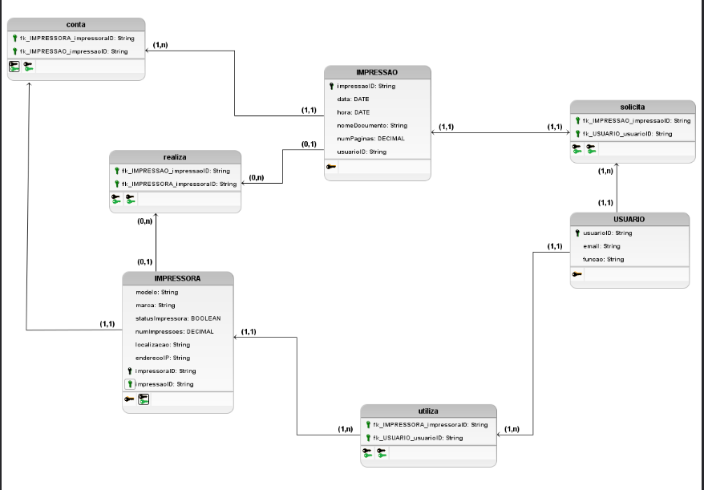

## Modelo Entidade-Relacionamento (ME-R)
### 1) Entidades
• IMPRESSORA

• USUARIO

• IMPRESSAO

• LOTACAO

• CARGO

### 2) Descrição das Entidades
- IMPRESSORA (<u>impressoraID</u>, enderecoIP, modelo, localizacao, marca, statusImpressora, numImpressoes)
- USUARIO (<u>usuarioID</u>, email, cargoID, documento, lotacaoID , senha, nome)
- IMPRESSAO (<u>impressaoID</u>, impressoraID, dataImpressao, nomeDocumento, numPaginas, usuarioID)
- CARGO(<u>cargoID</u>, nomeCargo)
- LOTACAO(<u>lotacaoID</u>, nomeLotacao, endereco(rua, logradouro, complemento, bairro, cidade, cep, numero))

### 3) Relacionamentos:

USUARIO - **esta** - LOTACAO 
Um usuário está alocado em uma lotação e uma lotação aloca vários usuários
Cardinalidade – N:1

USUARIO - **tem** - CARGO
Um usuário tem um cargo e um cargo pode ser tido por vários usuários.
Cardinalidade – N:1

IMPRESSORA – **realiza** – IMPRESSAO
Cada impressora tem a capacidade de realizar impressões, permitindo que documentos sejam impressos por ela. Cada impressão será realizada por uma impressora.
Cardinalidade – 1: N

USUARIO – **utiliza** – IMPRESSORA
Cada usuário tem a capacidade de utilizar uma ou mais impressoras para realizar tarefas de impressão, permitindo a associação entre um usuário e as impressoras que eles usam.
Cardinalidade – N : M

USUARIO – **solicita** – IMPRESSAO
Cada registro de contagem de impressões é associado a um usuário que iniciou a tarefa de impressão, possibilitando a identificação do usuário responsável.
Cardinalidade – 1:N

IMPRESSORA – **conta** – IMPRESSAO
Cada registro de contagem de impressões está vinculado a uma impressora, permitindo rastrear as estatísticas de impressão para cada dispositivo.
Cardinalidade – 1:N

### Diagrama Entidade-Relacionamento (DE-R)

### Diagrama Lógico de Dados (DLD)

|**Data**|**Descrição**|**Autore(es)**|
|--------|-------------|--------------|
| 18/10/2023 | Criação do documento | Júlia Farias Sousa|
| 20/10/2023 | Adicionando referências e versionamento | Júlia Farias Sousa|
| 20/10/2023 | Adicionando segunda versão | Antonio Rangel |
