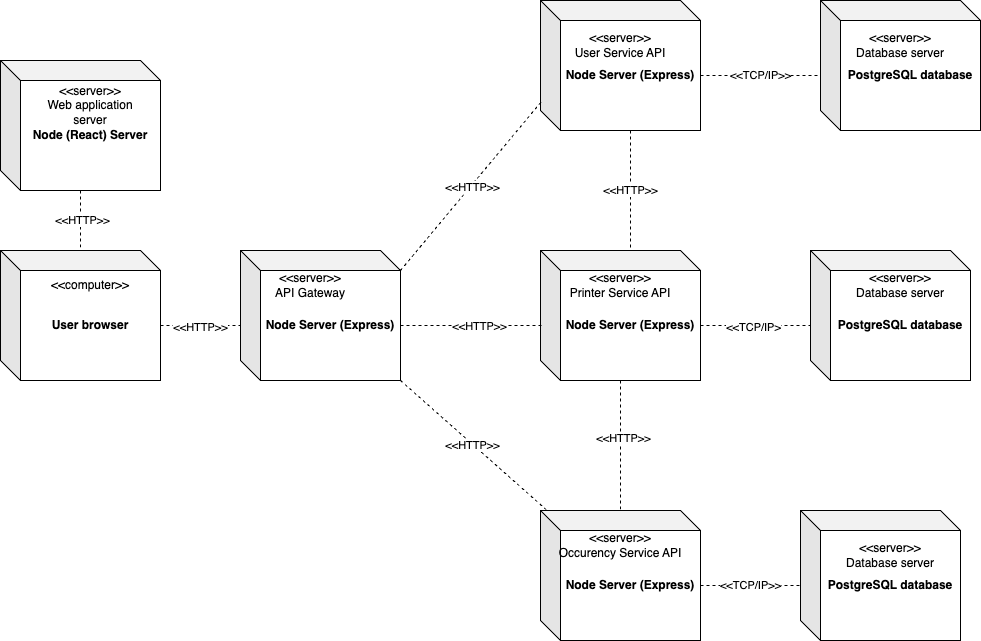

# Documento de Arquitetura

## 1. Introdução
Este documento tem como principal objetivo fornecer uma visão abrangente e estruturada da arquitetura do sistema. Ele descreve as principais decisões de design, componentes, módulos, interações e estrutura do software.

## 1.1. Visão Geral
Este documento está estruturado da seguinte forma:
- Introdução
- Representação arquitetural
- Visão Lógica
- Referências bibliográficas
- Histórico de versão

## 2. Representação Arquitetural

## 3. Visão Lógica
### 3.1 Diagrama de Pacotes

#### 3.1.1 Introdução

&emsp;&emsp;O Diagrama de Pacotes é um diagrama estrutural utilizado para organizar as classes de um projeto em pacotes. Um pacote é uma coleção de elementos relacionados, o que inclui diagramas, classes e pacotes de eventos. Ele proporciona uma visibilidade de alto nível, o que é interessante principalmente para grandes projetos e sistemas. 

&emsp;&emsp;Nosso diagrama de pacotes segue a arquitetura definida pelas diretrizes da disciplina, que é a arquitetura de microsserviços, então foi definido o pacote maior como o nosso sistema e dentro dele encontramos primeiro a camada do front-end, que realiza requisições para a camada abaixo que representa o back-end  que possui os nossos 3 microsserviços (UserService, PrintService e OcurrenceService) e que por fim se relaciona com o banco de dados.

    <i>Imagem 1: Diagrama de Pacotes 
    Versão 1.0 </i>

#### 3.1.1.2 Símbolos e componentes utilizados
Seta tracejada: indica as dependências em uma representação visual de como um elemento influencia o outro.

Pacote: definição usada para agrupar elementos relacionados dentro de um sistema.

### 3.1.1.3 Dependências

Dependência simples(use): Uma alteração do pacote destino influencia no pacote origem.

Importação do elemento (acess): O pacote origem acede a elementos exportados pelo pacote de destino.

Importação de pacote (import): O conteúdo público do pacote de destino é adicionado ao pacote de origem.

### 3.2 Diagrama de implantação

## 4. Referencências bibliográficas

> [1] EQUIPE ALECTRION 2022-2. Documento de Arquitetura. Disponível em: https://fga-eps-mds.github.io/2022-2-Alectrion-DOC/#/./Documentos/arquitetura. Acesso em: 18 out. 2023.

> [2] SOARES, João Pedro; ESTANISLAU, Matheus. Documento de Arquitetura. Disponível em: https://fga-eps-mds.github.io/2022-1-Alectrion-DOC/documentation/Documentos/documento-arquitetura.html. Acesso em: 18 out. 2023.

## 5. Histórico de versão

|**Data**|**Descrição**|**Autore(es)**|
|--------|-------------|--------------|
| 20/10/2023 | Criação do documento | Vitor Diniz |
| 20/10/2023 | Adicionado diagrama de implantação | Vitor Diniz |
| 20/10/2023 | Adicionando referências e versionamento | Vitor Diniz |
| 20/10/2023 | Adicionando texto do diagrama de pacotes | Júlia Farias Sousa |
