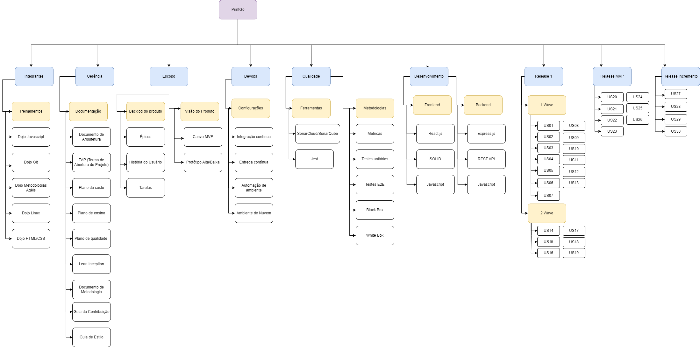

# Introdução à Estrutura Analítica do Projeto (EAP)

## Introdução

A gestão eficaz de projetos é uma competência no campo da engenharia de software para que possa concluir projetos de desenvolvimento de software dentro do prazo e dentro do orçamento é um desafio constante para profissionais de software. Uma ferramenta fundamental que nos ajuda a atender a esse desafio é a Estrutura Analítica do Projeto, ou simplesmente EAP.

Neste documento, exploraremos o conceito da EAP e como ela se tornou uma base na gestão de projetos de software. A EAP, como uma ferramenta de decomposição hierárquica, oferece insights valiosos e clareza na identificação e organização de todas as tarefas envolvidas em um projeto.

## EAP do PrintGO

## Histórico de versão
| Data | Versão | Descrição | Autor(es) |
| ---- | ---- | ---- | ---- |
| 08/10/2023 | 1.0 | Criação do Documento | Natanael Fernandes|