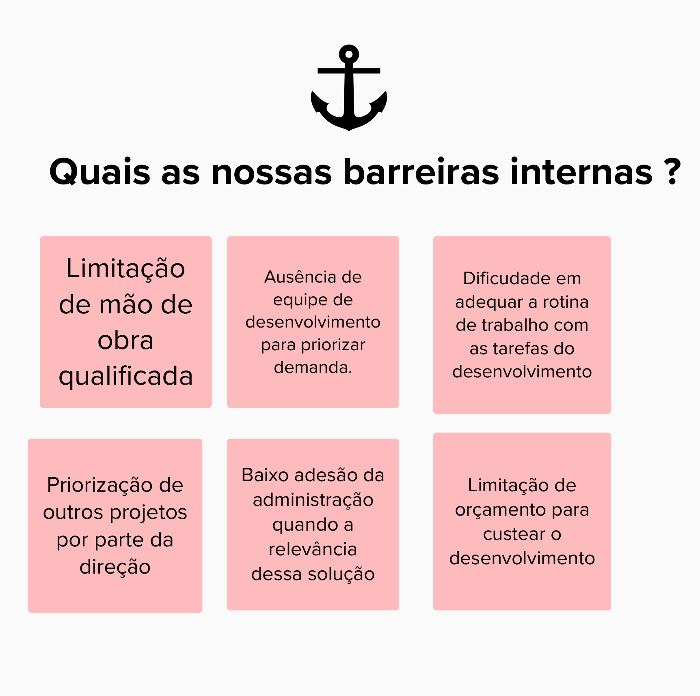

# Dinâmicas

## Panorama

### **O que é a atividade do Panorama?**

Esta atividade foi realizada dia 13/09/2023 e é utilizada para conhecer melhor os clientes e o ambiente que os envolvem. É utilizada uma analogia com um barco, onde tanto os clientes quanto as equipes de EPS e MDS estão navegando no mesmo barco. Em cada etapa da atividade, os clientes preencheram o quadro com post-its.

### **Qual é o nosso objetivo?**

O objetivo do barco é chegar na ilha do tesouro, este tesouro sendo a resolução do problema. Então os clientes escreveram no quadro qual seria o tesouro que eles querem alcançar.

### **Quais os nossos pontos fortes?**

No exemplo do barco, os nossos pontos fortes são o vento que irá levar o barco adiante. Na prática, os pontos fortes são como os clientes podem ajudar as equipes de EPS e MDS.

### **Quais as nossas barreiras internas?**

As barreiras internas são fatores que inviabilizem/impeçam a execução da atividade ou do projeto, de ser realizada ou executada de maneira interna.
Dentro do contexto do barco, uma barreira interna que o barco possui seria por exemplo a âncora, que impede o barco/navio de se mover.

### **Quais as nossas barreiras externas?**
As barreiras externas são representadas como os tubarões na analogia, e na vida real são os problemas que estão fora do alcance do cliente e que podem atrapalhar o caminho até o objetivo.

### **Discussões**
A etapa de discussões se resume a agrupar o que a equipe entendeu sobre a dinâmica e tirar eventuais dúvidas com os clientes.

### **Resultado final da atividade**
Objetivos:

Pontos Fortes:

Barreiras Internas:

Barreiras Externas:

Discussões:

## 3. Referências

> [1] Design Thinking - IBM. Disponível em: https://www.ibm.com/design/thinking/page/framework/

## 4. Histórico de versão

|**Data**|**Descrição**|**Autor(es)**|
|--------|-------------|--------------|
|04/10/2023| Criação do Documento | Antonio Rangel e Vitor Diniz |
