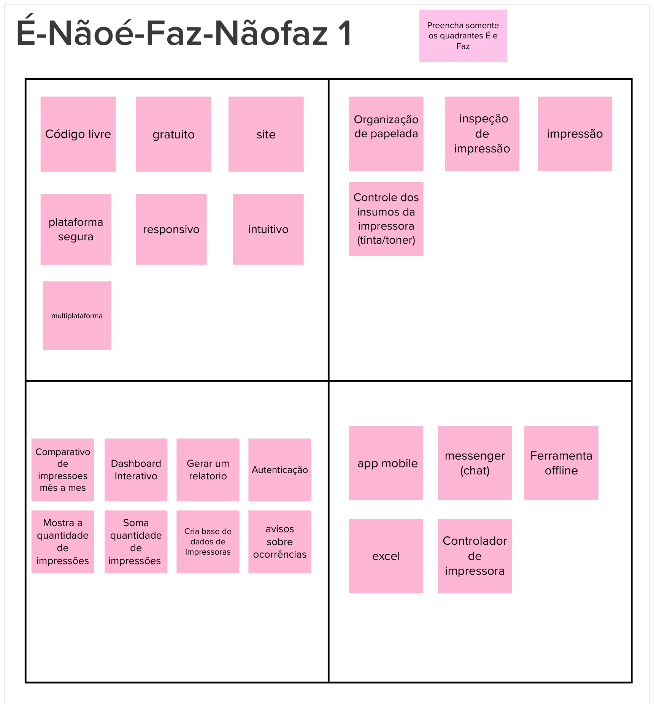

# É, Não é, Faz, Não faz

## 1. Definição
A atividade __É - Não É - Faz - Não__ ajuda a definir um tópico (seja um produto, um time ou uma estratégia). Por vezes, é mais fácil descrever algo pelo que tal coisa não é ou deixa de fazer. Essa atividade busca clarificações desta forma, indagando, especificamente, cada aspecto positivo e negativo sobre ser ou fazer algo.

Durante esta etapa no Lean Inception, a equipe colabora para estabelecer de forma precisa os limites do escopo do produto ou projeto. Essa abordagem é essencial para estabelecer critérios definidos e evitar ambiguidades na definição do escopo.

## 2. Resultado

Versão 1:

Versão 2:

## 3. Referências

> [1] EQUIPE ALECTRION 2022-2. É, Não é, Faz, Não faz. Disponível em: https://fga-eps-mds.github.io/2022-2-Alectrion-DOC/#/./Leaninception/e-naoe-faz-naofaz

> [2] Lean Inception - Como alinhar pessoas e construir o produto certo. Paulo Caroli.

## 4. Histórico de versão

|**Data**|**Descrição**|**Autor(es)**|
|--------|-------------|--------------|
|28/09/2023| Criação do Documento | Vitor Diniz |
