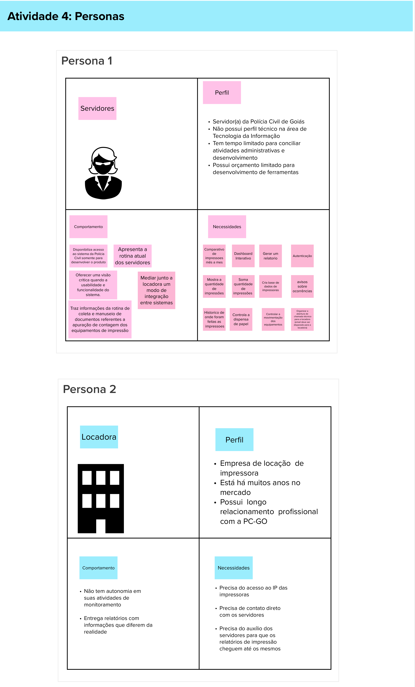

# Personas

## 1. Definição
A atividade de definição de __Personas__  tem como objetivo identificar efetivamente as funcionalidades de um produto, a maneira
geralmente utilizada para representar os usuários é por meio de personas. Uma persona representa um usuário do produto ou serviço,descrevendo não só o seu papel, mas também suas necessidades específicas. Isso cria uma representação realista de usuários,auxiliando o time a descrever funcionalidades do ponto de vista de quem interagirá com o produto final.

Para a dinâmica foi realizado um mapa de empatia, o mapa de empatia é um template visual para identificar e visualizar
uma persona. Criado originalmente para análise de segmentos de consumidores, ele é uma excelente ferramenta para classificar,
explorar e entender os diferentes tipos de personas.

No quadro abaixo conseguimos ver o resultado da dinâmica realizada com o cliente para a definição das personas, foram definidas duas personas:

- Servidores
- Locadora

## 2. Resultado

## 3. Referências

> [1] Lean Inception - Como alinhar pessoas e construir o produto certo. Paulo Caroli.

## 4. Histórico de versão

|**Data**|**Descrição**|**Autor(es)**|
|--------|-------------|--------------|
|10/10/2023| Criação do Documento |Júlia Farias Sousa|
||