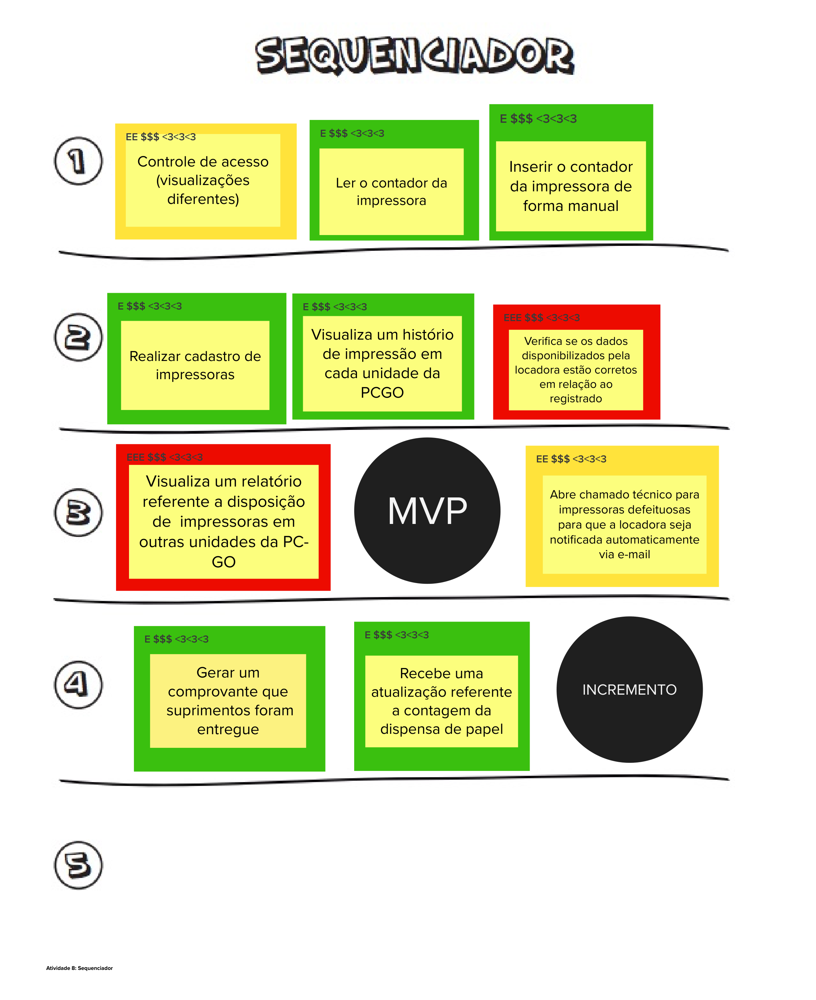

# Sequenciador

## 1. Definição
O sequenciador é um template que consiste em uma sequência de ondas numeradas, onde cada onda representa um conjunto de funcionalidades a serem desenvolvidas. O objetivo do sequenciador é priorizar as funcionalidades do produto de acordo com sua importância e impacto, permitindo que o MVP e suas evoluções subsequentes sejam identificados e desenvolvidos de forma mais eficiente.

## 2. Resultado

## 3. Referências

> [2] Lean Inception - Como alinhar pessoas e construir o produto certo. Paulo Caroli.

## 4. Histórico de versão

|**Data**|**Descrição**|**Autor(es)**|
|--------|-------------|--------------|
|28/09/2023| Criação do Documento | Júlia Farias, Wolfgang Stein, Felipe Amorim, Antonio Rangel |
|28/09/2023| Revisão do Documento | Felipe Amorim |
