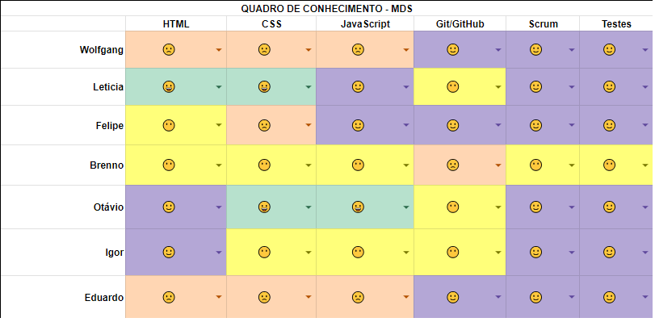
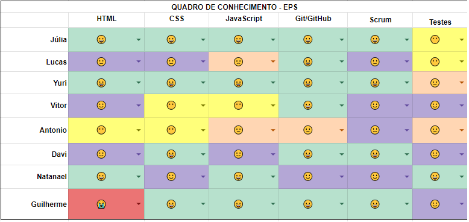

# Semana 1
## Visão geral
**Data de Inicio:** 29/09/2023

**Data de Término:** 03/09/2023

## Atividades realizadas

### Levantamento do quadro de Conhecimento

Quadro de Conhecimento dos MDS:

Quadro de Conhecimento dos EPS:

Legenda dos Quadros de Conhecimento:

### Criação dos canais de comunicação
- Um grupo foi criado na plataforma WhatsApp com os membros de EPS e MDS
- Um canal na plataforma Discord foi criado para comunicação por voz, compartilhamento de tela e troca de mensagens

## Histórico de versão
| Data | Versão | Descrição | Autor(es) |
| ---- | ---- | ---- | ---- |
| 06/09/2023 | 1.0 | Criação do Documento | Antonio Rangel Chaves |